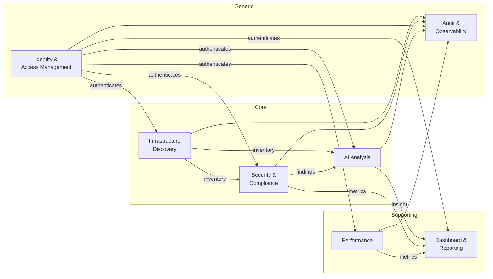

# DDD-01: Strategic Design

## Domain Vision

> **NOIP gives operators a single, intelligent view of their infrastructure
> and security posture, with AI-driven insight and an auditable trail of
> every action taken on or by the platform.**

The domain is **NetOps Intelligence**: continuously discovering
infrastructure, scoring it for security and compliance, augmenting human
judgement with AI analysis, and presenting it in dashboards while preserving
a full audit history.

## Stakeholders

| Stakeholder | Concerns |
|-------------|----------|
| Platform admin | Operate the platform; manage tenants, users, SSO. |
| Security analyst | Triage findings, run scans, write policies. |
| Compliance officer | Evidence for SOC2/ISO27001/HIPAA; control coverage. |
| SRE | Cluster drift, performance, on-call alerts. |
| Executive | Dashboards summarising posture and trend. |
| Auditor | Read-only access to audit log; provenance. |
| Service account / CI | Programmatic ingestion and queries. |

## Subdomain Classification

NOIP's subdomains are partitioned into **Core**, **Supporting**, and
**Generic** to direct investment:

| Subdomain | Type | Why |
|-----------|------|-----|
| **Infrastructure Discovery** | **Core** | Differentiation: continuous, accurate inventory of clusters, networks, cloud assets. |
| **Security & Compliance** | **Core** | Differentiation: domain-aware scanning, policy & framework coverage. |
| **AI Analysis** | **Core** | Differentiation: context-aware insight via Claude + RAG. |
| **Dashboard & Reporting** | Supporting | Important, but commodity capability. |
| **Performance** | Supporting | Necessary for self-monitoring; not differentiator. |
| **Identity & Access Management** | Generic | Standard SSO/MFA/RBAC, must be solid but not differentiator. |
| **Audit & Observability** | Generic | Must satisfy compliance; commodity in mechanics. |

This classification informs build/buy decisions (e.g. consider Auth0/Keycloak
for IAM if costs of a first-party implementation outweigh the integration
benefit).

## High-level Model

## Investment Posture

- **Core** subdomains: in-house implementation, premium engineering effort,
  protected against vendor lock-in.
- **Supporting**: in-house but with willingness to adopt OSS components
  (Plotly, Grafana panels) and to outsource later if friction grows.
- **Generic**: prefer mature OSS / SaaS; today implemented in-house but
  decisions are governed by ADR-0006/0008/0009/0017 with explicit ACLs so
  swap-out is feasible.

## Strategic Patterns Applied

- **Bounded contexts** — one model per context; cross-context integration
  through events / API barrels (DDD-04).
- **Open Host Service + Published Language** — IAM, Discovery, and Security
  publish stable read APIs and event schemas consumed by Dashboard and AI.
- **Anti-Corruption Layer** — between AI and Anthropic / Python / RAG
  (DDD-16); between Discovery and Kubernetes API; between IAM and SSO
  providers.
- **Customer/Supplier** — Dashboard is the *customer* of Security and AI
  (which act as *suppliers*); supplier prioritisation honours the customer's
  evolving needs through the events.
- **Conformist** — IAM's SSO flows conform to upstream IdP shapes (SAML
  metadata, OIDC discovery) within the ACL.

## Out-of-scope (today)

- Multi-tenant SaaS partitioning — single-tenant deployments only; tenancy
  primitives are reserved for a future ADR.
- Mobile apps.
- Long-running plan / remediation orchestration (out of scope; we recommend
  what to do but do not orchestrate it).
