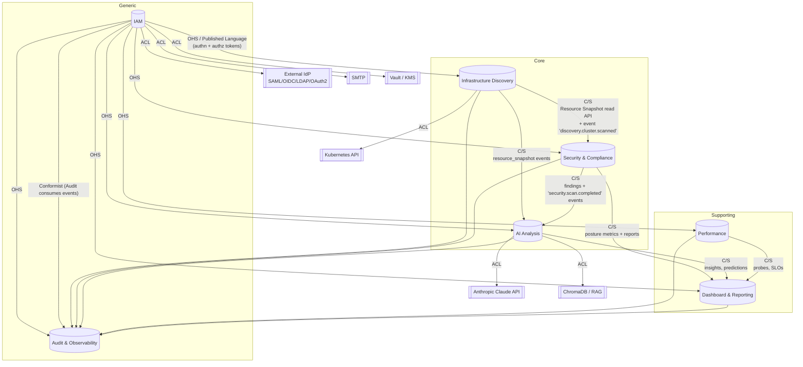

# DDD-04: Context Map

The context map names *every* integration between bounded contexts and labels
it with the relevant DDD pattern. It is the contract surface of the platform.

## Diagram



## Pattern legend

- **OHS — Open Host Service** — the supplier publishes a stable, public-by-
  contract API.
- **PL — Published Language** — the OHS uses a deliberately stable schema
  (typed events, well-defined DTOs).
- **C/S — Customer/Supplier** — supplier prioritises the customer's needs
  through co-evolved contracts.
- **Conformist** — the downstream consumer adopts the upstream's model
  without translation (used for `Audit` consuming events because the value
  *is* fidelity to the upstream model).
- **ACL — Anti-Corruption Layer** — translation barrier between models that
  must not bleed (DDD-16).
- **SK — Shared Kernel** — a small, deliberately shared code/model surface.

## Shared Kernel

The smallest possible kernel — anything beyond it leaks coupling.

- **Identifiers** — branded UUIDv7 types (`UserId`, `RoleId`, `SessionId`,
  `ResourceId`, `ScanId`, etc.).
- **Time types** — UTC `Instant`, `Duration`.
- **Domain event envelope** — `DomainEvent<T>` (DDD-12).
- **Severity** — `'low' | 'medium' | 'high' | 'critical'`.
- **Result/Either** type for service responses (`ServiceResponse<T>`,
  `src/types/index.ts`).

The kernel lives in `src/contexts/shared/kernel/` (target layout) and is
governed by a separate ownership rule: changes require sign-off from each
context's lead.

## Per-edge contracts

### IAM → all (OHS / PL)

The `iam.api` module exposes:

```ts
authenticate(token: string): Promise<Principal | null>
authorize(principal, resource, action, context?): Promise<AuthorizationDecision>
getUserProfile(userId: UserId): Promise<UserProfile>
listUserPermissions(userId: UserId): Promise<Permission[]>
```

Tokens (JWTs) are the published language for principal identity.

### Discovery → Security/AI (C/S)

`discovery.api`:

```ts
getLatestSnapshot(scope: Scope): Promise<ResourceSnapshot>
listSnapshots(scope: Scope, range: TimeRange): Promise<ResourceSnapshotRef[]>
streamEvents(): Subscription<DiscoveryEvent>
```

Events: `discovery.cluster.scanned`, `discovery.drift.detected`,
`discovery.snapshot.archived`.

### Security → AI/Dashboard (C/S)

`security.api`:

```ts
getScore(scope: Scope): Promise<SecurityScore>
listFindings(scope: Scope, filter: FindingFilter): Promise<Finding[]>
generateComplianceReport(framework: Framework, scope: Scope): Promise<ComplianceReport>
streamEvents(): Subscription<SecurityDomainEvent>
```

Events: `security.scan.completed`, `security.finding.opened`,
`security.finding.resolved`, `compliance.report.generated`.

### AI → Dashboard (C/S)

`ai.api`:

```ts
getLatestInsights(scope: Scope): Promise<Insight[]>
runAnalysis(request: AIAnalysisRequest): Promise<AIAnalysisResult>
```

Events: `ai.analysis.completed`.

### Performance → Dashboard

`performance.api`:

```ts
getCurrentSLOStatus(): Promise<SLOSnapshot>
runProbe(target: string): Promise<ProbeResult>
```

### All → Audit (Conformist)

The Audit context **conforms** to producers. It:

- Persists every domain event verbatim into `securityEvents` /
  `auditLogs`.
- Does not transform or interpret payloads beyond hashing/sealing.
- Performs schema validation; unknown fields are kept (forward-compatible).

This deliberately uses the *Conformist* pattern: the value of audit is
fidelity, not translation.

## Customer / Supplier dynamics

- **Dashboard is a customer** of Security, AI, and Performance. Dashboard's
  shape *drives* what the suppliers expose.
- **AI is a customer** of Discovery and Security. Its prompt-templates dictate
  what shapes those upstream contexts must publish.
- **Audit is a downstream consumer** with no upstream pull; it accepts what is
  published.

## Failure semantics

| Edge | Failure | Behaviour |
|------|---------|-----------|
| App → IAM authn | Token invalid | `401`. |
| App → IAM authz | Decision deny | `403`. |
| Dashboard → Security | Supplier degraded | Dashboard renders cached snapshot; widget shows staleness. |
| AI → Anthropic | Provider 429/5xx | ACL retries with backoff; surfaces a typed `AIBackpressureError`. |
| Discovery → Kubernetes | API throttle | ACL retries with backoff; emits `discovery.scan.degraded`. |
| Producer → Audit | Bus unavailable | Producer writes to local outbox; Audit drains on recovery. |
