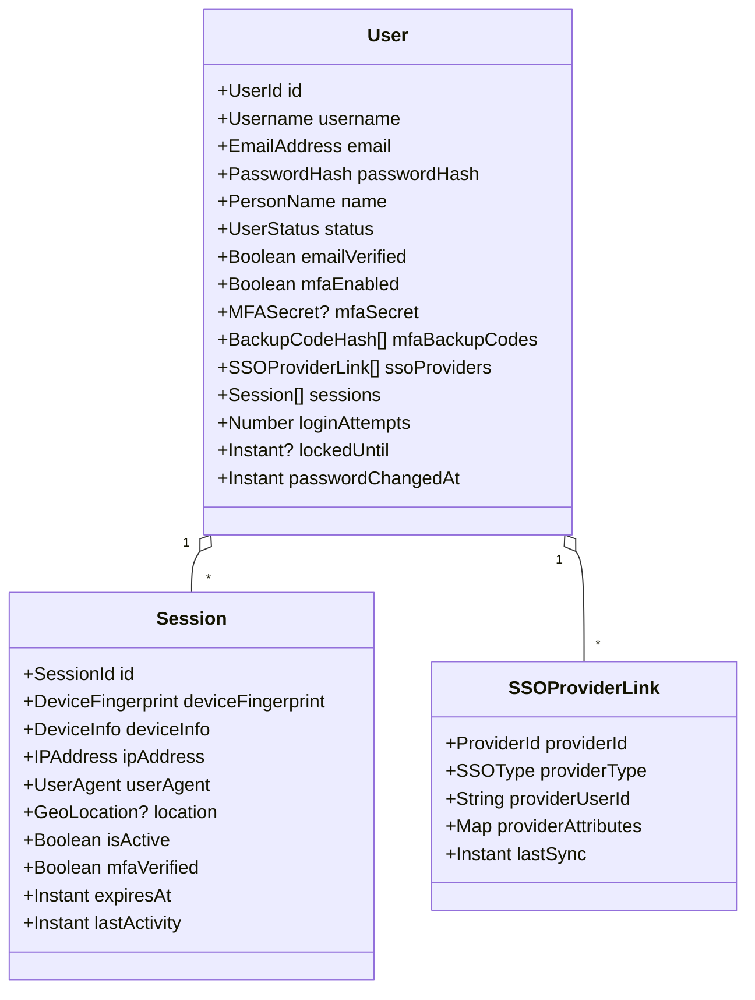
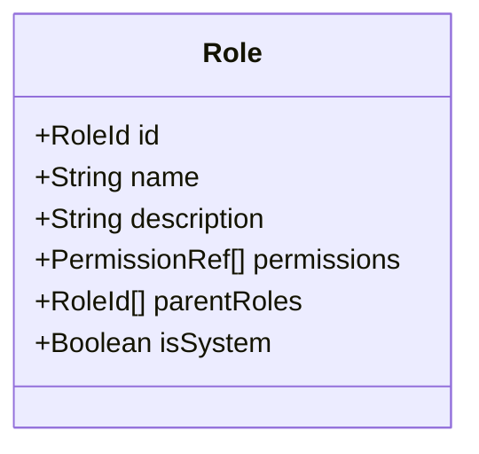
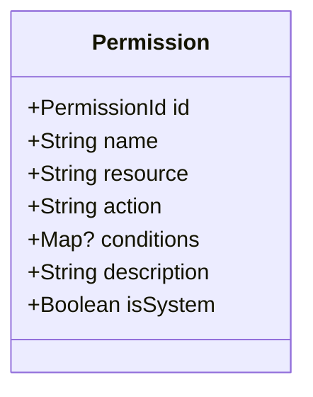
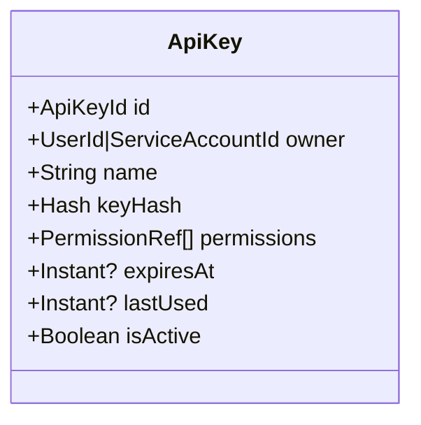
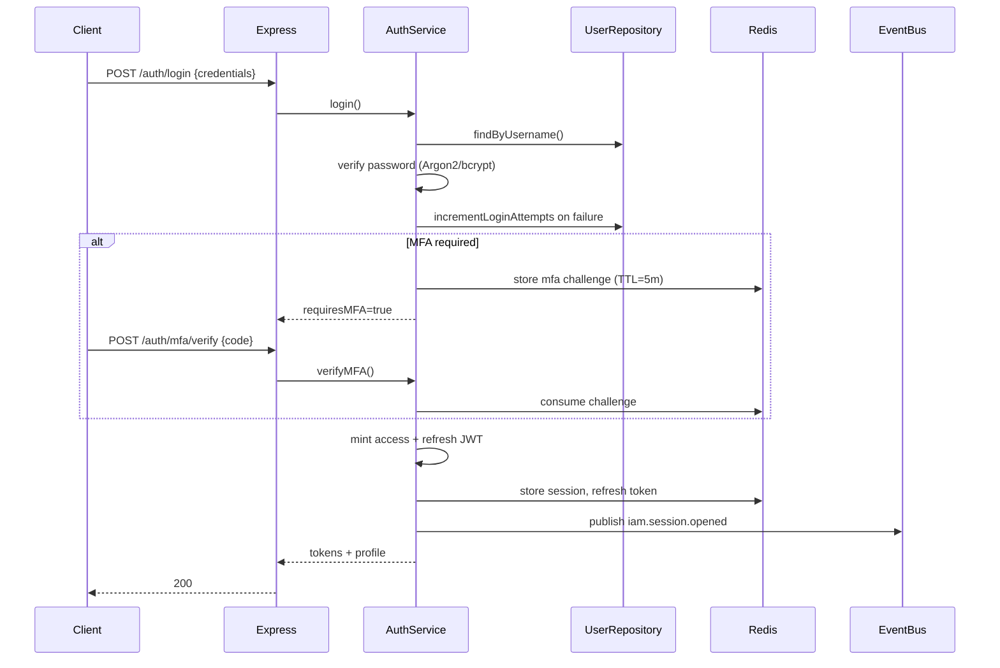
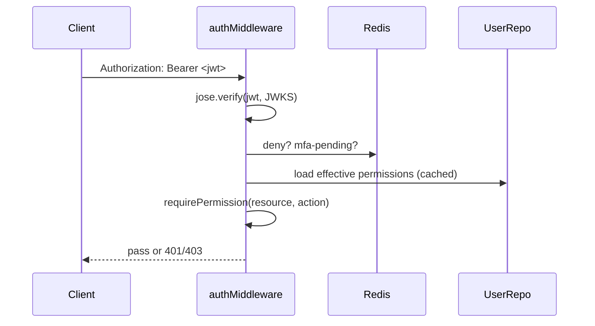

# DDD-05: Identity & Access Management Context

**Subdomain type:** Generic
**Source-tree home (target):** `src/contexts/iam/`
**Current locations:** `src/services/auth.service.ts`,
`src/controllers/auth.controller.ts`, `src/routes/auth.routes.ts`,
`src/models/{user,role,permission,session,security-event}.model.ts`,
`src/middleware/auth.middleware.ts`, `src/types/auth.types.ts`.

## Purpose

Authenticate every actor (human, service, API key) and authorise every
sensitive operation. Provide MFA, SSO, password lifecycle, session
management, and lockout protection.

## Ubiquitous Language (this context)

See [DDD-02 IAM section](./02-ubiquitous-language.md#identity--access-management-iam-context).

## Aggregates

### Aggregate: `User`

Root entity that owns the credential lifecycle and derived state.



**Invariants:**

1. Username and email are unique per tenant.
2. `passwordHash` is non-empty and produced by Argon2id (or legacy bcrypt
   awaiting rehash) — see ADR-0007.
3. `loginAttempts >= 0`. After `5` consecutive failures, `lockedUntil` is
   set to now+`accountLockoutDuration`.
4. `mfaSecret` is never serialised in API responses; transformed in
   `User.toJSON`.
5. `passwordChangedAt` is updated on every password change and is enforced
   when validating tokens (`token.iat < passwordChangedAt` ⇒ token revoked).
6. A `Session` belongs to exactly one user and cannot be transferred.
7. `sessions.length <= maxConcurrentSessions` (`5` default); on overflow the
   oldest active session is closed.

**Operations (commands):**

| Command | Effect | Emits |
|---------|--------|-------|
| `register` | Create `User` in `pending_verification` | `iam.user.registered` |
| `verifyEmail` | `emailVerified = true`, status → `active` | `iam.user.email_verified` |
| `login(credentials, deviceInfo)` | Open `Session` if checks pass | `iam.session.opened` or `iam.login.failed` |
| `failLogin` | Increment `loginAttempts`; lock if threshold | `iam.login.failed`, `iam.account.locked?` |
| `logout(sessionId)` | Close the session | `iam.session.closed` |
| `changePassword` | Update hash, revoke other sessions | `iam.password.changed`, `iam.token.revoked` × n |
| `requestPasswordReset` | Mint reset token (10-min TTL) | `iam.password.reset_requested` |
| `confirmPasswordReset` | Set new password, clear lockout | `iam.password.reset_confirmed` |
| `enableMFA(method)` | Stage secret; require verification | `iam.mfa.enrolment_started` |
| `verifyMFA(code)` | Complete enrolment **or** challenge | `iam.mfa.enabled` / `iam.mfa.verification_success` / `iam.mfa.verification_failed` |
| `disableMFA` | Remove secret, backup codes; require recent password | `iam.mfa.disabled` |
| `linkSSOProvider` | Add `SSOProviderLink` | `iam.sso.linked` |
| `lockAccount` | Set `lockedUntil` | `iam.account.locked` |
| `unlockAccount` | Clear `lockedUntil`, reset attempts | `iam.account.unlocked` |

### Aggregate: `Role`



**Invariants:**

1. Role hierarchy is a DAG (no cycles).
2. `isSystem` roles are immutable except by privileged migration.
3. A role cannot grant a permission outside the global registry.

### Aggregate: `Permission`



**Invariants:**

1. `name == ${resource}.${action}` (or `${resource}.${action}.${qualifier}`).
2. `(resource, action)` tuple is unique per registry.
3. `conditions` keys are drawn from a closed registry of evaluators.

### Aggregate: `ApiKey`



**Invariants:**

- The plaintext key is shown **once** at creation; only `keyHash` is stored.
- Permissions on the key are a subset of the owner's effective permissions.

### Aggregate: `ServiceAccount`

A non-human principal owning one or more `ApiKey`s. Treated as a `User`-shaped
actor for authz, but cannot perform IAM-management operations.

## Value Objects

- `UserId` (UUIDv7), `RoleId`, `PermissionId`, `SessionId`, `ApiKeyId`.
- `EmailAddress` (validated, lowercased).
- `Username` (regex `/^[a-zA-Z0-9_-]+$/`, length 3..50).
- `PersonName(first, last)`.
- `PasswordHash` (encoded `algo$cost$salt$digest`).
- `MFASecret` (Base32 encoded; never logged).
- `BackupCodeHash` (Argon2id of code).
- `DeviceFingerprint` (opaque hash of UA, screen, etc.).
- `DeviceInfo(platform, browser, version, mobile, trusted, lastSeen)`.
- `IPAddress`, `UserAgent`, `GeoLocation`.
- `JWTPayload`, `JWTTokenPair`.
- `UserStatus` enum: `active`, `inactive`, `suspended`, `locked`,
  `pending_verification`.
- `SSOType` enum.

## Domain Services

- **`PasswordPolicyService`** — validate plaintext passwords against
  configured policy.
- **`PasswordHasher`** — Argon2id/bcrypt; selects algorithm based on
  encoding prefix.
- **`MFAEnroller`** — generates TOTP secret + backup codes; validates
  enrolment confirmation.
- **`SessionRiskScorer`** — flags suspicious sessions (geo/device anomaly).
- **`AuthorizationEvaluator`** — given `(principal, resource, action,
  context)`, returns allow/deny with reason.
- **`TokenMinter` / `TokenVerifier`** — JWT issuance and validation against
  the active key set.

## Repositories

- `UserRepository` — `findById`, `findByUsername`, `findByEmail`,
  `findByVerificationToken`, `findActive`, `save`, `delete`.
- `RoleRepository`, `PermissionRepository`, `ApiKeyRepository`,
  `ServiceAccountRepository`.
- `SessionStore` (Redis-backed) — `get(sessionId)`, `put(session)`,
  `delete(sessionId)`, `listByUser(userId)`.
- `TokenDenylist` (Redis-backed) — `revoke(jti, exp)`,
  `isRevoked(jti)`.

(Concrete persistence in DDD-14.)

## Application Services

In `src/contexts/iam/application/`:

- `AuthService` (already in `src/services/auth.service.ts`):
  - `register`, `login`, `refresh`, `logout`, `verifyEmail`,
    `requestPasswordReset`, `confirmPasswordReset`, `changePassword`.
  - `setupMFA`, `verifyMFA`, `disableMFA`, `regenerateBackupCodes`.
  - `linkSSO`, `unlinkSSO`, `loginViaSSO`.
- `UserAdminService`:
  - `createUser`, `updateUser`, `assignRoles`, `revokeRoles`, `lockUser`,
    `unlockUser`, `deactivateUser`, `forcePasswordReset`.
- `RoleAdminService`:
  - `createRole`, `updateRole`, `deleteRole`, `addPermissions`,
    `removePermissions`.
- `ApiKeyService`:
  - `issueKey`, `rotateKey`, `revokeKey`, `listKeys`.

## Public API (barrel)

```ts
// src/contexts/iam/api/index.ts (target)
export interface IamPublicApi {
  authenticate(token: string): Promise<Principal | null>;
  authorize(p: Principal, resource: string, action: string, ctx?: object): Promise<AuthDecision>;
  getUserProfile(id: UserId): Promise<UserProfile>;
  listUserPermissions(id: UserId): Promise<Permission[]>;
}
export type { Principal, AuthDecision, UserProfile };
```

This is the **only** module other contexts may import from IAM.

## Domain Events emitted

See [DDD-12](./12-domain-events.md) for full schemas.

- `iam.user.registered`
- `iam.user.email_verified`
- `iam.session.opened`, `iam.session.closed`, `iam.session.suspicious`
- `iam.login.failed`, `iam.login.succeeded`
- `iam.account.locked`, `iam.account.unlocked`
- `iam.mfa.enrolment_started`, `iam.mfa.enabled`, `iam.mfa.disabled`,
  `iam.mfa.verification_success`, `iam.mfa.verification_failed`
- `iam.password.changed`, `iam.password.reset_requested`,
  `iam.password.reset_confirmed`
- `iam.token.revoked`, `iam.permission.escalated`
- `iam.sso.linked`, `iam.sso.unlinked`
- `iam.role.created`, `iam.role.updated`, `iam.role.deleted`
- `iam.permission.granted`, `iam.permission.revoked`
- `iam.apikey.issued`, `iam.apikey.revoked`

## HTTP surface

`/api/auth/*`:

- `POST /register`, `POST /login`, `POST /refresh`, `POST /logout`
- `POST /password/reset`, `POST /password/reset/confirm`
- `POST /password/change`
- `POST /mfa/setup`, `POST /mfa/verify`, `POST /mfa/disable`,
  `POST /mfa/backup-codes`
- `GET /me`, `GET /me/sessions`, `DELETE /me/sessions/:id`
- `GET /sso/:provider/start`, `GET /sso/:provider/callback`

`/api/admin/*` (privileged):

- `GET /users`, `POST /users`, `PATCH /users/:id`, …
- `GET /roles`, `POST /roles`, …
- `GET /api-keys`, `POST /api-keys`, …

## Persistence

(See [DDD-14](./14-repositories-and-persistence.md) for indexes.)

- Mongo collections: `users`, `roles`, `permissions`, `apiKeys`,
  `serviceAccounts`.
- Sessions in Redis (`noip:sess:*`); a denormalised `User.sessions` array is
  retained for admin views and cross-device session list.
- Token denylist in Redis (`noip:deny:*`).
- MFA challenge state in Redis (`noip:mfa:*`).

## Cross-context relationships

- **OHS** to all other contexts (publishes `IamPublicApi` and event stream).
- **ACL** to external IdPs (SAML, OIDC, LDAP, OAuth2) and SMTP — DDD-16.

## Key flows

### Login (with MFA)



### Authorization on every request



## Risks & open questions

- **Password rehash on login** must be transactional with the verification
  step to avoid races.
- **MFA gracePeriod** transition: when a user becomes subject to MFA they
  must be funnelled to enrolment within `MFA_GRACE_PERIOD`.
- **Permission cache invalidation**: `iam.permission.escalated` must
  invalidate per-session caches across all pods (Redis pub/sub).
