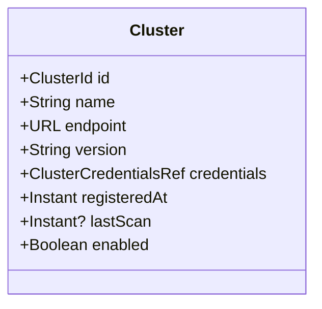
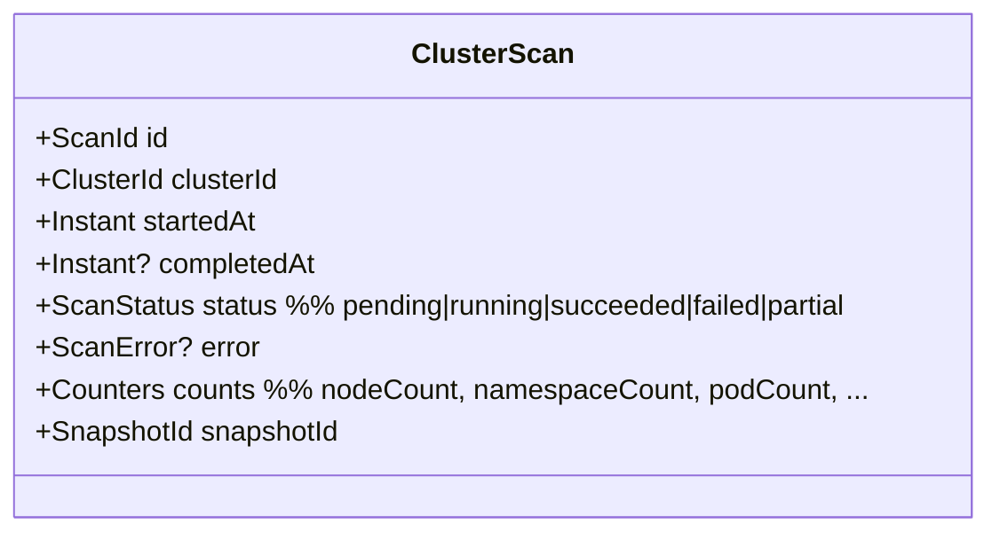
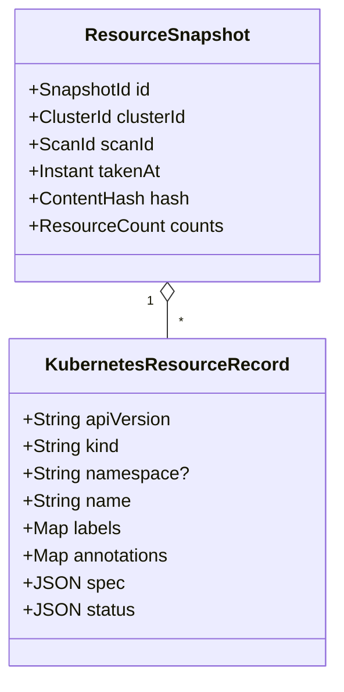
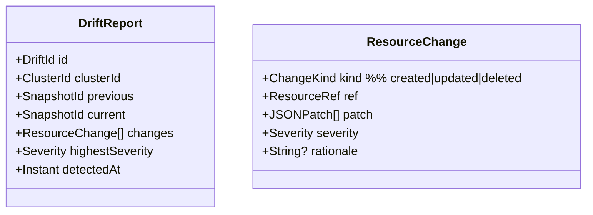

# DDD-06: Infrastructure Discovery Context

**Subdomain type:** Core
**Source-tree home (target):** `src/contexts/discovery/`
**Current locations:** `src/services/discovery.service.ts`,
`src/types/index.ts:KubernetesResource,ClusterInfo`.

## Purpose

Continuously and accurately observe Kubernetes clusters (and, eventually,
cloud assets and network topology), producing immutable snapshots that other
contexts consume.

## Ubiquitous Language

See [DDD-02 Discovery](./02-ubiquitous-language.md#infrastructure-discovery-context).

## Aggregates

### Aggregate: `Cluster`



**Invariants:**

- `endpoint` resolved to TLS endpoint with valid certificate.
- `credentials` is a reference to a `Secret` — never inlined.
- A scan can only run if `enabled == true`.

### Aggregate: `ClusterScan`



**Invariants:**

- A scan transitions monotonically: `pending → running → (succeeded | failed | partial)`.
- Once `completedAt` is set, the scan is immutable.
- Exactly one `ResourceSnapshot` per successful scan.

### Aggregate: `ResourceSnapshot`



**Invariants:**

- Snapshots are immutable.
- `hash = sha256(canonical_json(records))`. Snapshot equality is hash-based.
- Records are sorted deterministically before hashing for reproducibility.

### Aggregate: `DriftReport`



**Invariants:**

- A drift report references exactly two consecutive snapshots for the same
  cluster scope.
- `changes` is non-empty (otherwise no report is created).

## Value Objects

- `ClusterId`, `ScanId`, `SnapshotId`, `DriftId`.
- `ResourceRef(apiVersion, kind, namespace?, name)` — globally identifies a
  resource within a cluster.
- `ContentHash`.
- `ScanStatus`, `ChangeKind`, `Severity`.
- `Counters(nodeCount, namespaceCount, podCount, serviceCount, …)`.

## Domain Services

- **`ScanPlanner`** — produces a list of API resources/kinds to fetch
  (driven by RBAC and CRD discovery).
- **`SnapshotHasher`** — canonical JSON + sha256.
- **`DriftCalculator`** — diff two snapshots; classify changes by severity
  (e.g. `Pod.spec.containers[].securityContext.privileged` flip is HIGH).
- **`KubernetesClient` (port)** — interface; the implementation is the ACL
  to the kube-apiserver (DDD-16).

## Repositories

- `ClusterRepository`.
- `ClusterScanRepository`.
- `ResourceSnapshotRepository` — large; supports pagination by `kind`,
  `namespace`, label selector.
- `DriftReportRepository`.

## Application Services

- `DiscoveryService` (already in `src/services/discovery.service.ts`):
  - `registerCluster(spec)`.
  - `triggerScan(clusterId)`.
  - `getCluster(id)`.
  - `getResources(clusterId, namespace?, filter?)`.
  - `getNamespaces(clusterId)`.
  - `getNodeInfo(clusterId)`.
  - `getLatestSnapshot(clusterId)`.
  - `compareSnapshots(prev, curr)`.
  - `scheduleScans()` — long-running periodic scheduler.

## Public API (barrel)

```ts
// src/contexts/discovery/api/index.ts (target)
export interface DiscoveryPublicApi {
  getLatestSnapshot(scope: Scope): Promise<ResourceSnapshot>;
  listSnapshots(scope: Scope, range: TimeRange): Promise<ResourceSnapshotRef[]>;
  getResource(ref: ResourceRef, at?: Instant): Promise<KubernetesResourceRecord | null>;
  streamEvents(): Subscription<DiscoveryEvent>;
}
```

## Domain Events emitted

- `discovery.cluster.registered`
- `discovery.cluster.scan_started`
- `discovery.cluster.scanned` — payload: `{ clusterId, snapshotId, counts }`
- `discovery.cluster.scan_failed`
- `discovery.snapshot.archived` (storage tiering)
- `discovery.drift.detected` — payload: `{ clusterId, driftId, highestSeverity }`

## HTTP surface

`/api/discovery/*`:

- `GET /clusters`, `POST /clusters`, `DELETE /clusters/:id`
- `GET /clusters/:id`, `POST /clusters/:id/scan`
- `GET /clusters/:id/snapshots`, `GET /clusters/:id/snapshots/:snapshotId`
- `GET /clusters/:id/resources?namespace=&kind=…`
- `GET /clusters/:id/namespaces`, `GET /clusters/:id/nodes`
- `GET /clusters/:id/drift`, `GET /drift/:driftId`

## Persistence

- Mongo collections: `clusters`, `clusterScans`, `resourceSnapshots`,
  `driftReports`.
- `resourceSnapshots` is the largest table; archived to S3 cold storage after
  90 days using `resourceSnapshots_archive` referenced by id.
- Indexes:
  - `clusterScans` — `(clusterId, startedAt: -1)`.
  - `resourceSnapshots` — `(clusterId, takenAt: -1)`,
    `(clusterId, hash)` (unique to detect no-change scans).
  - `driftReports` — `(clusterId, detectedAt: -1)`.

## ACLs

- **Kubernetes API ACL** (`KubernetesAdapter`) — translates kube objects to
  `KubernetesResourceRecord`; handles versioned `apiextensions`, paginated
  list calls, watch streams (future), retries on `429`.
- **Cloud SDK ACL** (future) — for cloud-asset inventory.

## Cross-context relationships

- Customer/Supplier with **Security & Compliance** and **AI** (suppliers).
- Publishes events consumed by **Audit**.

## Risks & open questions

- The current `DiscoveryService` in code uses **mock data**; the production
  implementation must:
  - Authenticate to kube-apiserver via in-cluster service-account token or
    out-of-cluster kubeconfig (Vault-backed).
  - Use `kubectl-style` paginated listing via the official client.
  - Respect rate limits and per-resource scope.
- Storage growth: per-snapshot records may be large (>10 MiB); compression
  and tiering are required for retention beyond 30 days.
