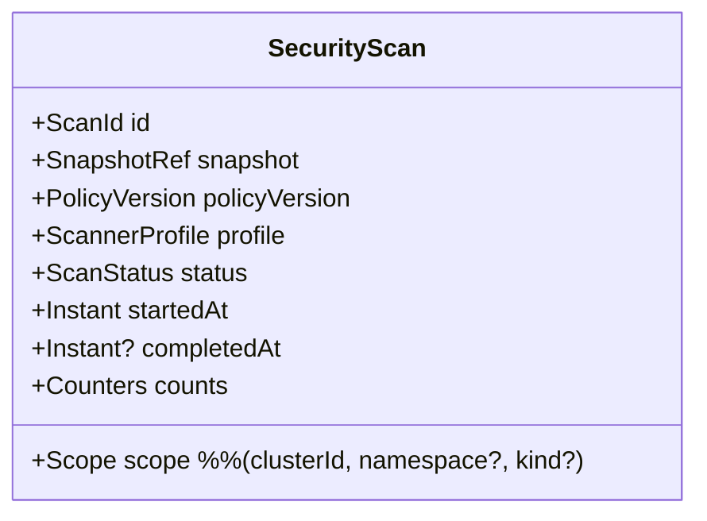
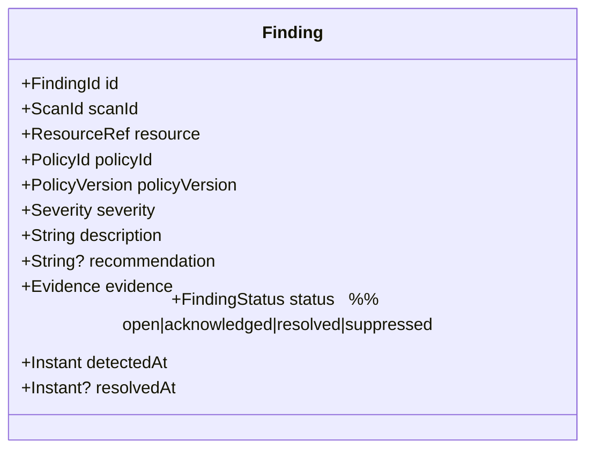
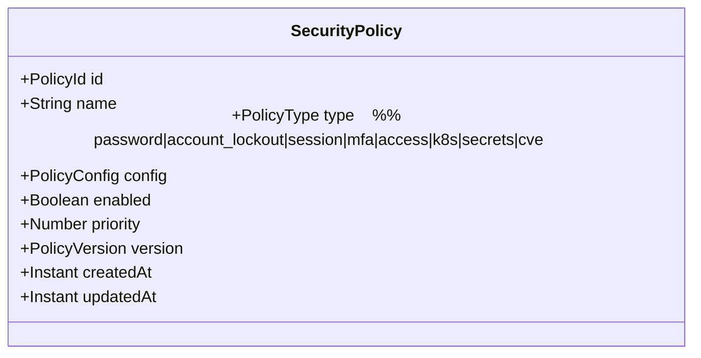
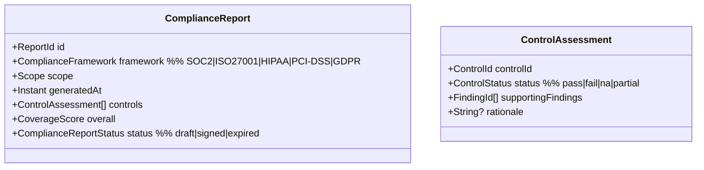

# DDD-07: Security & Compliance Context

**Subdomain type:** Core
**Source-tree home (target):** `src/contexts/security/`
**Current locations:** `src/services/security.service.ts`,
`src/services/compliance.service.ts`, `src/controllers/compliance.controller.ts`,
`src/routes/compliance.routes.ts`.

## Purpose

Evaluate inventory snapshots against vulnerability data and policies, produce
findings and remediation recommendations, and prove compliance with
frameworks (SOC2, ISO27001, HIPAA, PCI-DSS, GDPR).

## Ubiquitous Language

See [DDD-02 Security & Compliance](./02-ubiquitous-language.md#security--compliance-context).

## Aggregates

### Aggregate: `SecurityScan`



**Invariants:**

- Bound to one immutable `ResourceSnapshot` (provenance).
- Bound to one `PolicyVersion` (reproducibility).
- Findings are created within the scan's transaction; once `completedAt` is
  set the scan is immutable.

### Aggregate: `Finding`



**Invariants:**

- A finding is *closed* by transitioning to `resolved` only when a later
  scan no longer detects it (auto) or by explicit acknowledgement.
- A `suppressed` finding requires `expiresAt` and a justification.
- `Evidence` is immutable for the finding's life.

### Aggregate: `SecurityPolicy`



**Invariants:**

- A policy update bumps `PolicyVersion` (immutable historical versions).
- Scans always reference the version that was current at scan start.

### Aggregate: `ComplianceReport`



**Invariants:**

- A report is **derived** from scans + policies as of `generatedAt`.
- Once `signed` it is immutable; later regenerations create new reports.

## Value Objects

- `Scope`, `Severity`, `Evidence`, `PolicyVersion`, `ControlId`,
  `CoverageScore`, `ScannerProfile`.
- `ComplianceFramework` enum.
- `FindingStatus`, `ControlStatus`.

## Domain Services

- **`PolicyEngine`** — evaluates a policy against a resource record;
  produces zero or more findings.
- **`SeverityClassifier`** — maps raw signals to `Severity` using a defined
  matrix (e.g. CVSS bucketing, K8s misconfig table).
- **`PostureScorer`** — converts findings into a 0–100 `Security Score`
  per scope, weighted by severity and affected-asset count.
- **`ComplianceMapper`** — maps findings/policies to framework controls.
- **`ScannerOrchestrator`** — runs scanners in parallel: image vuln (Trivy),
  K8s misconfig (kube-bench / kube-linter), secrets (gitleaks-style),
  network policy gap analysis.

## Repositories

- `SecurityScanRepository`, `FindingRepository`,
  `SecurityPolicyRepository`, `ComplianceReportRepository`.

## Application Services

- `SecurityService` (already in `src/services/security.service.ts`):
  - `runScan(scope, profile?)`.
  - `getScore(scope)`.
  - `listFindings(scope, filter)`.
  - `acknowledgeFinding(id, by, justification)`.
  - `suppressFinding(id, by, until, justification)`.
  - `resolveFinding(id, by, evidence)`.
  - `scanPodSecurity()`, `scanNetworkPolicies()` (existing operations).
  - `getRecommendations(scope)`.
- `ComplianceService` (already in `src/services/compliance.service.ts`):
  - `generateReport(framework, scope)`.
  - `signReport(reportId, by)`.
  - `listFrameworks()`.
  - `listControls(framework)`.

## Public API (barrel)

```ts
// src/contexts/security/api/index.ts (target)
export interface SecurityPublicApi {
  getScore(scope: Scope): Promise<SecurityScore>;
  listFindings(scope: Scope, filter?: FindingFilter): Promise<Finding[]>;
  generateComplianceReport(framework: ComplianceFramework, scope: Scope): Promise<ComplianceReport>;
  streamEvents(): Subscription<SecurityDomainEvent>;
}
```

## Domain Events emitted

- `security.scan.started`, `security.scan.completed`, `security.scan.failed`
- `security.finding.opened`, `security.finding.acknowledged`,
  `security.finding.suppressed`, `security.finding.resolved`
- `security.policy.created`, `security.policy.updated`,
  `security.policy.disabled`
- `compliance.report.generated`, `compliance.report.signed`,
  `compliance.report.expired`

## HTTP surface

`/api/security/*`:

- `GET /scan`, `POST /scan`, `GET /scan/pods`, `GET /scan/network`
- `GET /score`, `GET /findings`, `PATCH /findings/:id`
- `GET /policies`, `POST /policies`, `PATCH /policies/:id`
- `GET /recommendations`

`/api/compliance/*`:

- `GET /frameworks`, `GET /frameworks/:id/controls`
- `POST /reports`, `GET /reports`, `GET /reports/:id`,
  `POST /reports/:id/sign`

## Persistence

- Mongo collections: `securityScans`, `findings`, `securityPolicies`
  (and `securityPolicyVersions`), `complianceReports`.
- Indexes:
  - `findings`: `(scope.clusterId, severity, status)`,
    `(scanId)`, `(detectedAt: -1)`.
  - `complianceReports`: `(framework, generatedAt: -1)`.

## ACLs

- Vulnerability data feeds (NVD, GitHub Advisory, vendor feeds) — via a
  `VulnerabilityFeedAdapter`.
- External scanners (Trivy, kube-bench) — invoked through a sidecar with
  a typed adapter.

## Cross-context relationships

- Customer of **Discovery** (snapshots).
- Supplier to **AI** (findings) and **Dashboard** (scores, reports).
- Publishes events to **Audit**.

## Risks & open questions

- **Idempotency of finding lifecycle** — when re-scanning, an open finding
  whose pattern still matches must not be re-opened as a new ID. We reconcile
  by `(policyId, resource, fingerprint)` and update `lastSeenAt` on the
  existing finding.
- **Suppression governance** — must be auditable; `iam.permission` controls
  who can suppress what severity.
