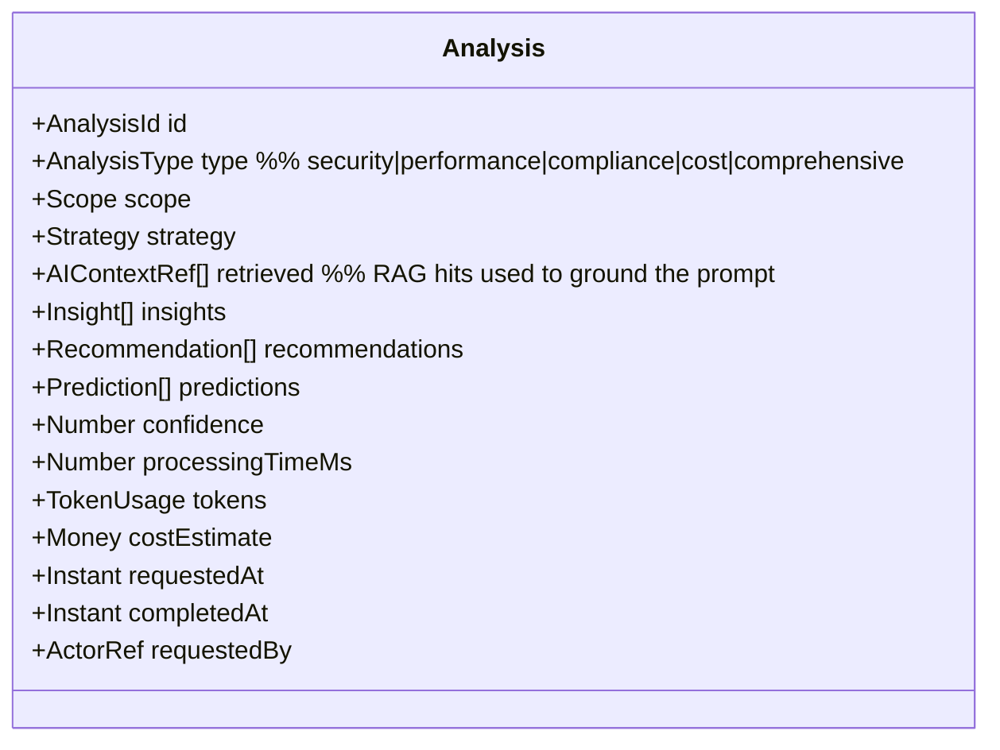
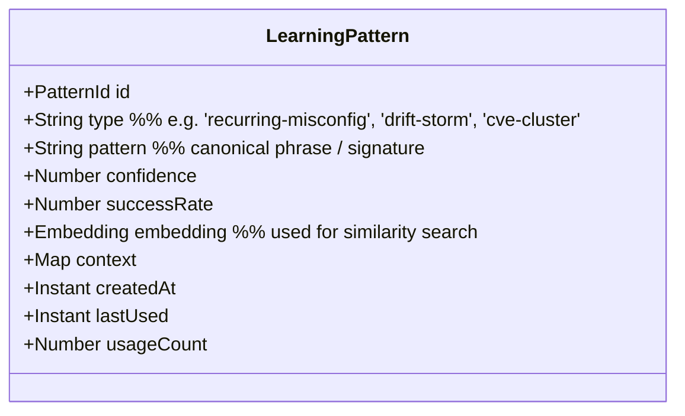
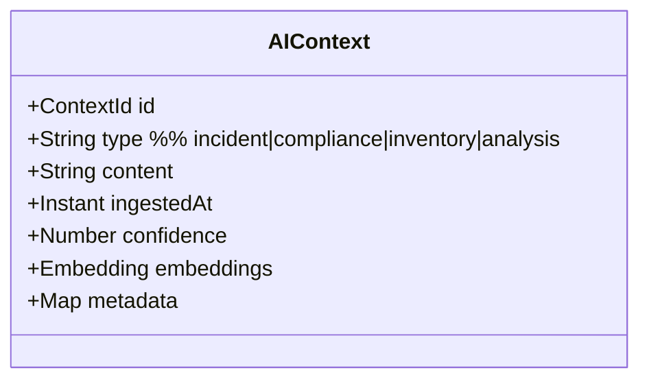

# DDD-08: AI Analysis Context

**Subdomain type:** Core
**Source-tree home (target):** `src/contexts/ai/`
**Current locations:** `src/services/ai.service.ts`,
`src/types/index.ts:AIAnalysisRequest,AIAnalysisResult,AIContext,AILearningPattern`,
`scripts/ai_analysis.py`, `scripts/update_rag.py`.

## Purpose

Produce grounded, citable analyses ("comprehensive", "security-focused",
"performance-optimization", "cost-optimization") that combine current
inventory + findings + historical RAG context, using Anthropic Claude.

## Ubiquitous Language

See [DDD-02 AI Analysis](./02-ubiquitous-language.md#ai-analysis-context).

## Aggregates

### Aggregate: `Analysis`



**Invariants:**

- An analysis records its `Strategy` (model, prompt template hash, retrieval
  policy) and the IDs of every retrieved chunk → fully reproducible.
- `confidence` is in `[0, 1]`.
- `tokens.input + tokens.output > 0`.

### Aggregate: `LearningPattern`



**Invariants:**

- `successRate` is updated only via positive reinforcement signals (analyst
  acknowledged the pattern was useful).
- Patterns are **soft-deleted** when `confidence < threshold`.

### Aggregate: `RAGCorpus`

The corpus lives outside Mongo (ChromaDB) and is reflected by a *projection*
collection `aiContexts` in Mongo for cross-reference and admin views.



**Invariants:**

- A context is ingested once (id = sha256(content)). Idempotent.
- Embeddings are produced by the configured embedding model and tagged with
  the model id.

## Value Objects

- `Strategy(modelId, promptTemplateHash, retrievalPolicy)`.
- `Insight(text, supportingContextIds[], severity, scope)`.
- `Recommendation(text, action, references[])`.
- `Prediction(text, horizon, probability)`.
- `TokenUsage(input, output, cacheRead, cacheWrite)`.
- `Money(amount, currency)`.
- `Embedding` — float[] with model tag.

## Domain Services

- **`PromptComposer`** — builds the system + user + tool messages from
  template, scope data, and retrieved RAG context. Stable system prompt
  enables Anthropic prompt caching.
- **`Redactor`** — strips sensitive substrings (secrets, PII, JWTs, IPs by
  policy) before transmission to the provider. Deterministic; emits a
  redaction report.
- **`ContextRetriever`** — top-k retrieval from ChromaDB with metadata
  filters; returns `AIContextRef[]` with score.
- **`AnthropicAdapter`** (ACL) — see [DDD-16](./16-anti-corruption-layers.md).
- **`PatternLearner`** — observes recurring `Insight` shapes; emits or
  updates `LearningPattern`s.

## Repositories

- `AnalysisRepository`, `LearningPatternRepository`,
  `AIContextProjectionRepository` (Mongo); `RAGStore` (Chroma client).

## Application Services

- `AIService` (already in `src/services/ai.service.ts`):
  - `analyzeInfrastructure(data)`.
  - `analyzeSecurity(scanResults)`.
  - `analyzeCompliance(resources)`.
  - `analyzePerformance(metrics)` (existing/planned).
  - `analyzeCost(scope)` (planned).
  - `getInsights(scope)` (read).
  - `provideFeedback(analysisId, useful: boolean, comment?)`.
  - `ingestContext(documents)` — invoked by ingestion job.

## Public API (barrel)

```ts
// src/contexts/ai/api/index.ts (target)
export interface AIPublicApi {
  runAnalysis(req: AIAnalysisRequest): Promise<AIAnalysisResult>;
  getLatestInsights(scope: Scope): Promise<Insight[]>;
  streamEvents(): Subscription<AIDomainEvent>;
}
```

## Domain Events emitted

- `ai.analysis.requested`, `ai.analysis.completed`, `ai.analysis.failed`
- `ai.context.ingested`, `ai.context.retired`
- `ai.pattern.learned`, `ai.pattern.deprecated`
- `ai.cost.budget_breached`

## HTTP surface

`/api/ai/*`:

- `POST /analyze/infrastructure`
- `POST /analyze/security`
- `POST /analyze/compliance`
- `POST /analyze/performance`
- `POST /analyze/cost`
- `GET /insights?scope=…`
- `POST /feedback/:analysisId`

## Persistence

- Mongo: `aiAnalyses`, `learningPatterns`, `aiContexts` (projection only).
- Chroma: collections per [ADR-0013](../adr/0013-rag-knowledge-base-chromadb.md).
- Redis: in-flight analysis lock (idempotent re-submits) and prompt-cache
  bookkeeping.
- Indexes:
  - `aiAnalyses` — `(scope.clusterId, type, completedAt: -1)`.
  - `learningPatterns` — `(type, confidence: -1)`.

## ACLs

- **AnthropicAdapter** — provider boundary; retries, prompt cache,
  redaction, token accounting (DDD-16).
- **ChromaAdapter** — embedding model selection, similarity calls.
- **Python ingestion bridge** — runs `scripts/update_rag.py` jobs through a
  CronJob; results are ingested via the same adapter.

## Cross-context relationships

- Customer of **Discovery** (snapshots), **Security** (findings),
  **Performance** (metrics).
- Supplier to **Dashboard** (insights, predictions).
- Publishes events to **Audit**.

## Data classification & redaction

Every payload sent to the provider passes through the `Redactor` with this
default policy:

| Class | Examples | Treatment |
|-------|----------|-----------|
| Secrets | API keys, passwords, MFA secrets, JWTs | Removed; replaced with `<REDACTED:type>`. |
| PII | Emails, names, IPs (depending on tenant policy) | Pseudonymised with deterministic hash. |
| Internal identifiers | UserId, SessionId | Replaced with opaque tokens. |
| Inventory | Manifests, kinds, namespaces, labels | Allowed (already operational data). |

The redacted payload is logged (without the original) for traceability;
inverse mapping is kept in Redis with a 24-hour TTL for support workflows.

## Risks & open questions

- **Cost control** — every request is bounded by `AI_MAX_TOKENS` and a daily
  per-user quota; breach emits `ai.cost.budget_breached` and 429s further
  requests.
- **Hallucination** — every `Insight` carries `supportingContextIds`; the UI
  flags insights without supporting context. We use this as a quality signal
  and to feed `LearningPattern.successRate`.
- **Provider outages** — `AnthropicAdapter` uses circuit breaker; on open
  state, AI endpoints return `503` with `Retry-After`.
