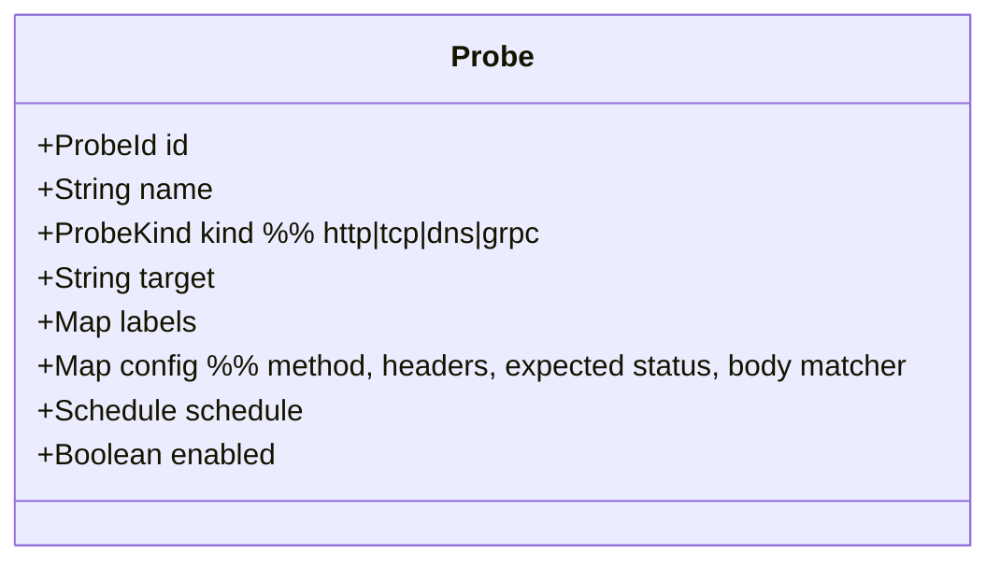
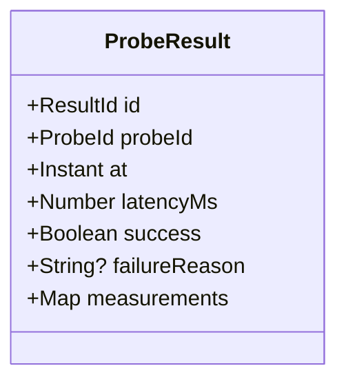
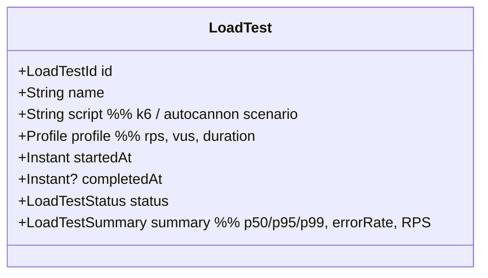
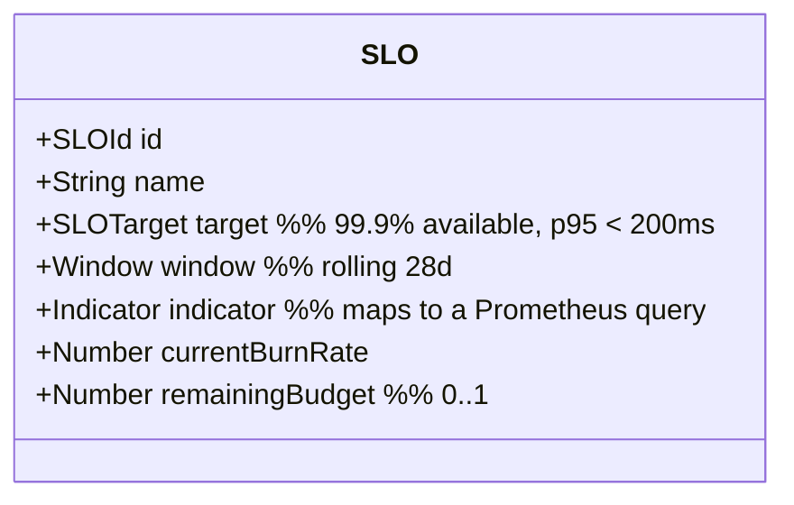

# DDD-09: Performance Context

**Subdomain type:** Supporting
**Source-tree home (target):** `src/contexts/performance/`
**Current locations:** `src/services/performance.service.ts`,
`src/controllers/performance.controller.ts`, `src/routes/performance.routes.ts`,
`tests/performance/`.

## Purpose

Self-monitor NOIP's own service-level performance, run synthetic probes and
load tests, and publish SLO posture for dashboards and alerts.

## Aggregates

### Aggregate: `Probe`



### Aggregate: `ProbeResult`



### Aggregate: `LoadTest`



### Aggregate: `SLO`



**Invariants:**

- An SLO is bound to one or more indicators (queries against the metric
  store).
- `remainingBudget` is recomputed periodically; never edited by hand.

## Value Objects

- `ProbeKind`, `Schedule`, `Profile`, `LoadTestStatus`, `Window`,
  `SLOTarget`, `Indicator`, `LoadTestSummary`.

## Domain Services

- **`ProbeRunner`** — executes a single probe and records the result.
- **`LoadTestExecutor`** — wraps k6/autocannon and ingests output.
- **`SLOComputer`** — periodic job that queries Prometheus and updates
  `SLO.remainingBudget` and `currentBurnRate`.

## Repositories

- `ProbeRepository`, `ProbeResultRepository`, `LoadTestRepository`,
  `SLORepository`.

## Application Services

- `PerformanceService` (already in `src/services/performance.service.ts`):
  - `createProbe`, `updateProbe`, `deleteProbe`, `runProbeNow`.
  - `listProbeResults(probeId, range)`.
  - `submitLoadTest(spec)`, `getLoadTest(id)`.
  - `defineSLO`, `getSLOStatus`.

## Public API (barrel)

```ts
// src/contexts/performance/api/index.ts
export interface PerformancePublicApi {
  getCurrentSLOStatus(): Promise<SLOSnapshot>;
  runProbe(target: string): Promise<ProbeResult>;
  recentLoadTests(): Promise<LoadTestSummary[]>;
}
```

## Domain Events emitted

- `performance.probe.failed`
- `performance.slo.breached`, `performance.slo.recovered`
- `performance.load_test.completed`

## HTTP surface

`/api/performance/*`:

- `GET /probes`, `POST /probes`, `PATCH /probes/:id`, `DELETE /probes/:id`
- `POST /probes/:id/run`
- `GET /probes/:id/results?from=&to=`
- `POST /load-tests`, `GET /load-tests`, `GET /load-tests/:id`
- `GET /slos`, `POST /slos`, `GET /slos/:id`

## Persistence

- Mongo: `probes`, `probeResults` (TTL on `at` of 30 days), `loadTests`,
  `slos`. Long-term metric series live in Prometheus, not Mongo.

## Cross-context relationships

- Supplier to **Dashboard** and **AI** (`AI` may consume SLO breaches as
  context for performance analyses).
- Producer of events to **Audit**.

## Risks & open questions

- High-volume probe results can balloon Mongo; we keep raw results 30 days
  and rely on Prometheus for longer windows.
- Load tests must be runnable against a *non-production* environment by
  default; running against prod requires a privileged role.
