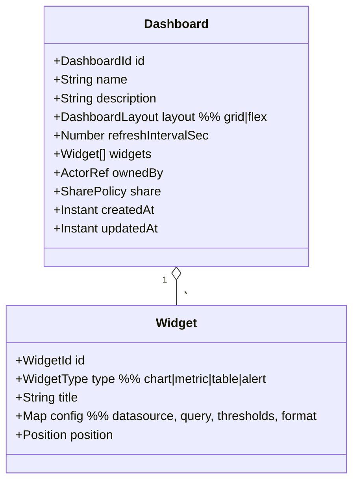
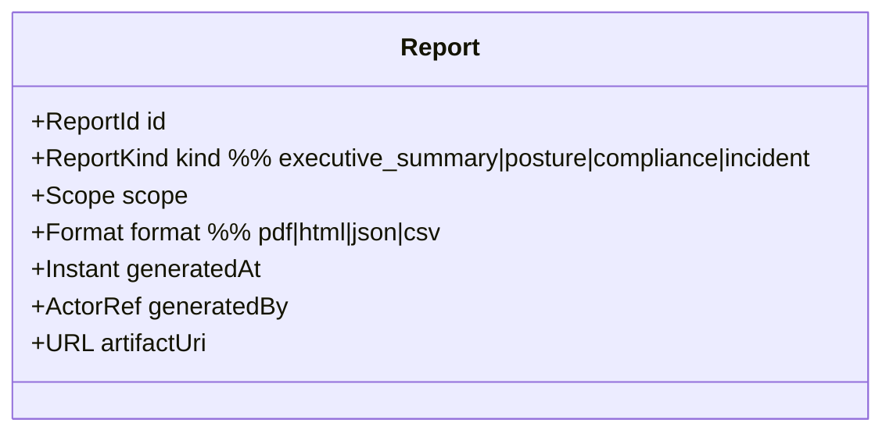

# DDD-10: Dashboard & Reporting Context

**Subdomain type:** Supporting
**Source-tree home (target):** `src/contexts/dashboard/`
**Current locations:** `src/services/dashboard.service.ts`,
`src/types/index.ts:DashboardWidget,DashboardConfig`, `dashboard.html`,
`scripts/generate_dashboard.py`.

## Purpose

Compose user-defined visualisations over data published by other contexts.
Generate static or live dashboards; export to JSON / CSV / PDF.

## Aggregates

### Aggregate: `Dashboard`



**Invariants:**

- `widgets` cannot overlap in a `grid` layout; positions are non-negative.
- `refreshIntervalSec >= 30`.
- `share.visibility ∈ {private, role-scoped, organisation}`; role-scoped
  shares carry an explicit role list.

### Aggregate: `Report`



**Invariants:**

- A report's artifact (PDF, etc.) is stored in object storage and is
  immutable; regeneration creates a new `Report`.

## Value Objects

- `Position(x, y, w, h)`.
- `WidgetType`, `DashboardLayout`, `SharePolicy`, `ReportKind`, `Format`.
- `Datasource(contextRef, query, parameters)`.

## Domain Services

- **`WidgetDataResolver`** — given a widget's `Datasource`, calls the
  appropriate context's public API and returns shaped data.
- **`ReportRenderer`** — produces PDF/HTML/CSV using the platform's renderer
  (Plotly + Headless Chromium for PDF).
- **`AccessChecker`** — enforces `SharePolicy` against the requesting
  principal.

## Repositories

- `DashboardRepository`, `ReportRepository`.

## Application Services

- `DashboardService` (already in `src/services/dashboard.service.ts`):
  - `createDashboard`, `updateDashboard`, `deleteDashboard`,
    `getDashboard`, `getAllDashboards`.
  - `getWidgetData(widgetId)`.
  - `share(dashboardId, policy)`.
- `ReportService`:
  - `generateReport(kind, scope, format)`.
  - `listReports(filter)`.

## Public API (barrel)

```ts
// src/contexts/dashboard/api/index.ts
export interface DashboardPublicApi {
  getDashboard(id: DashboardId): Promise<Dashboard | null>;
  generateReport(kind: ReportKind, scope: Scope, fmt: Format): Promise<Report>;
}
```

## Domain Events emitted

- `dashboard.created`, `dashboard.updated`, `dashboard.deleted`
- `dashboard.shared`
- `report.generated`

## HTTP surface

`/api/dashboard/*`:

- `GET /`, `POST /`
- `GET /:id`, `PATCH /:id`, `DELETE /:id`
- `GET /widget/:id/data`
- `POST /:id/share`

`/api/reports/*`:

- `POST /`, `GET /`, `GET /:id`, `GET /:id/artifact`

## Persistence

- Mongo: `dashboards`, `reports` (metadata only). Artifacts in object
  storage with signed URLs.

## Cross-context relationships

- Customer of every supplier context (Discovery, Security, AI, Performance,
  IAM for ownership).
- Mutations are local-only (creating dashboards); never writes to other
  contexts' models.

## Risks & open questions

- **Cache invalidation** — widgets cache their data per session; we use a
  short TTL plus event-driven invalidation (e.g. `security.scan.completed`
  invalidates security widgets).
- **PDF export** — Headless Chromium adds an operational dependency;
  alternative is server-side Plotly to PDF via Kaleido.
