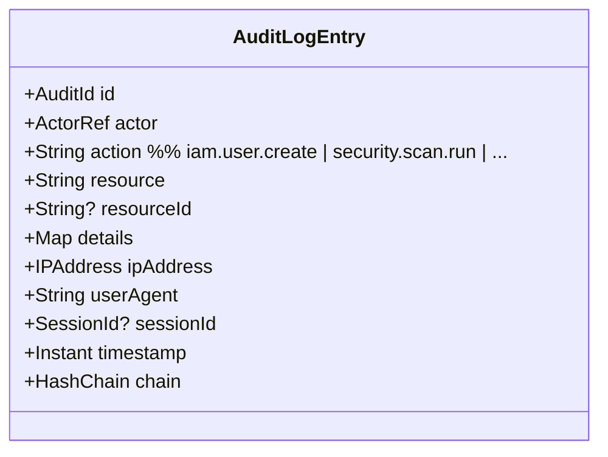
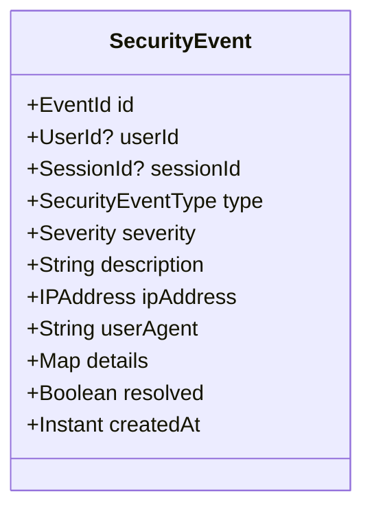
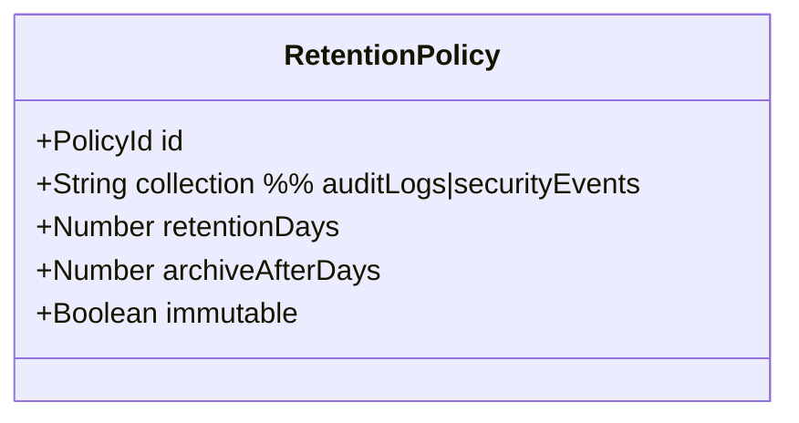

# DDD-11: Audit & Observability Context

**Subdomain type:** Generic
**Source-tree home (target):** `src/contexts/audit/`
**Current locations:** `src/middleware/audit.middleware.ts`,
`src/models/security-event.model.ts`,
`src/types/auth.types.ts:{SecurityEvent,SecurityEventType,AuditLog,SecurityPolicy}`.

## Purpose

Persist a tamper-evident record of all actor → resource interactions, expose
queries for incident response and compliance, and stand up the observability
plumbing (metrics, logs, traces) that the platform depends on.

## Aggregates

### Aggregate: `AuditLogEntry`



**Invariants:**

- Append-only: entries cannot be updated or deleted via API.
- `chain.previousHash` references the prior entry's `chain.currentHash`.
- `chain.currentHash = sha256(canonical_json(entryWithoutChain) || previousHash)`.

### Aggregate: `SecurityEvent`

The persisted form of a security-relevant `DomainEvent`.



**Invariants:**

- An event is `resolved=true` only when an analyst marks it so or an
  auto-resolver matches a closure rule.
- `severity` is non-decreasing in retroactive updates (we never *lower*
  severity once classified).

### Aggregate: `RetentionPolicy`



**Invariants:**

- `archiveAfterDays <= retentionDays`.
- Once `immutable=true`, the policy can only be tightened (longer retention,
  earlier archive).

## Value Objects

- `ActorRef` — `{ userId? | serviceAccountId? | system: true }`.
- `HashChain(previousHash, currentHash, sequence)`.
- `Severity`, `SecurityEventType`.

## Domain Services

- **`HashChainAppender`** — single-writer per shard; computes the chain hash
  on insert.
- **`ArchiveExporter`** — daily job; writes entries older than
  `archiveAfterDays` to S3 Object-Locked storage.
- **`SubscriberRouter`** — routes incoming domain events to:
  - `AuditLogEntry` (for state-changing events),
  - `SecurityEvent` (for security-relevant events),
  - notification destinations (Slack/email) per rule.

## Repositories

- `AuditLogRepository` (Mongo, write-only via append API).
- `SecurityEventRepository`.
- `RetentionPolicyRepository`.

## Application Services

- `AuditService`:
  - `query(filter)` — by actor / action / resource / time range.
  - `getEntry(id)`.
  - `verifyChainIntegrity(range)`.
- `SecurityEventService`:
  - `listEvents(filter)`.
  - `acknowledge(eventId, by)`.
  - `resolve(eventId, by, note)`.
- `ObservabilityService`:
  - `getMetrics()` (proxy to Prometheus).
  - `getTrace(traceId)`.

## Public API (barrel)

```ts
// src/contexts/audit/api/index.ts
export interface AuditPublicApi {
  query(filter: AuditFilter): Promise<AuditPage>;
  verifyChainIntegrity(range: TimeRange): Promise<ChainIntegrityReport>;
  listSecurityEvents(filter: SecurityEventFilter): Promise<SecurityEvent[]>;
}
```

## Subscriptions

The Audit context **subscribes to all** `<context>.<aggregate>.<change>`
events (DDD-12). This is the only context that does so; other contexts
remain decoupled from each other through the public API barrels.

## HTTP surface

`/api/audit/*` (privileged):

- `GET /logs?actor=&action=&from=&to=`
- `GET /logs/:id`
- `POST /logs/verify-chain` (range)
- `GET /events`, `PATCH /events/:id`
- `GET /metrics` (proxy)
- `GET /traces/:traceId`

## Persistence

- Mongo collections: `auditLogs`, `securityEvents`, `retentionPolicies`.
- Object storage: `s3://noip-audit-archive/<yyyy>/<mm>/<dd>/<shard>.jsonl.gz`
  with Object Lock + KMS encryption.
- Indexes:
  - `auditLogs`: `(timestamp: -1)`, `(actor.userId, timestamp: -1)`,
    `(action, timestamp: -1)`, `(resource, resourceId, timestamp: -1)`.
  - `securityEvents`: `(severity, createdAt: -1)`,
    `(userId, createdAt: -1)`, `(type, createdAt: -1)`, `(resolved)`.

## Cross-context relationships

- **Conformist** to producers — accepts events as published, validates the
  envelope, persists faithfully.
- Reverse-direction calls (`Audit → others`) are read-only via the producers'
  public APIs (e.g. resolving `userId` to a profile when rendering a report).

## Tamper evidence

The hash chain is published daily to a transparency log (Sigstore Rekor or a
local equivalent). A `chain-integrity` cron job verifies the chain end-to-end
and emits `audit.chain.broken` if it ever fails.

## Risks & open questions

- **High write throughput** — chain serialisation requires single-writer
  semantics; we shard by `actor.userId` mod N, so each shard has its own
  chain. Verifiers honour shard boundaries.
- **Event-loss handling** — if Audit cannot persist an incoming event, the
  producer must retry from the outbox. We treat audit ingestion as
  at-least-once; deduplication by `event.id`.
